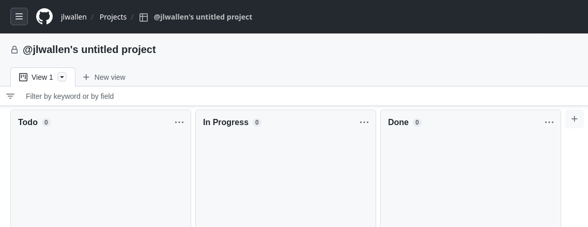
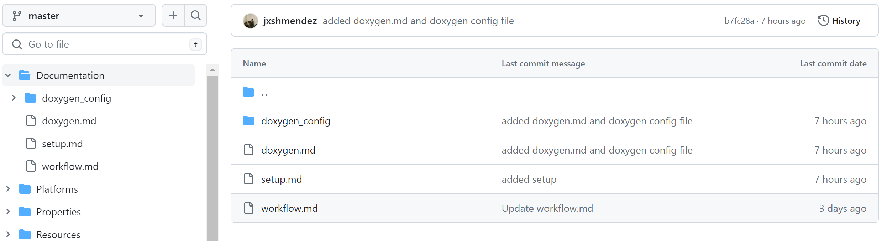
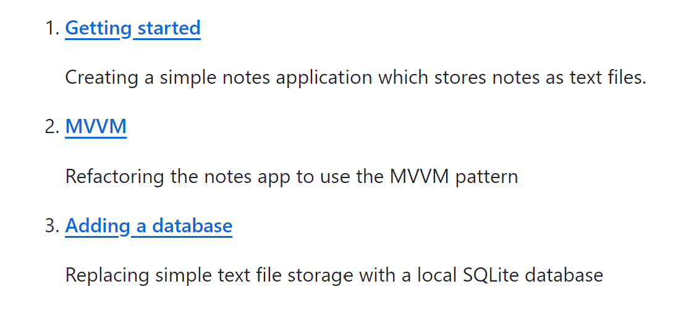
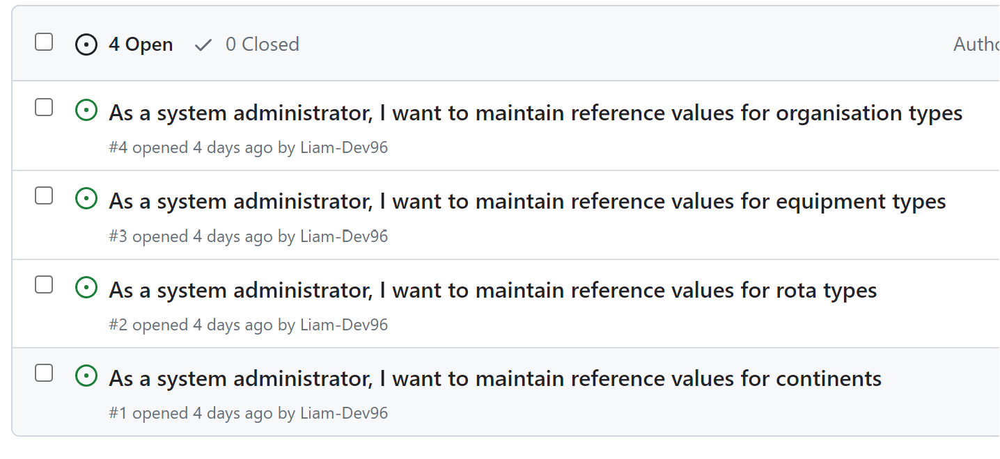

# Portfolio - Week 10.

## The context of this week

This week has been quite special in my Software Engineering "career" since I started the module. 

<b>I decided to change teams and join the blue team.</b> The reasons behind this decision were as follows :

1- Imagining that the blue team was going to be made up of fewer people than the other teams (I was in the orange team), I thought that communication would be much better overall. 
Indeed, during the previous weeks in the orange team, and especially during the weeks working on the UNDAC project, the lack of coordination between team members was very noticeable. 
For example, I realised that in week 8, one of the team members had started doing the same task as me, even though I'd assigned it to myself and put it in the "in progress" category on the Kanban board.
What's more, I noticed that some members of the team were acting like ghosts: they weren't necessarily coming to the classes, they weren't communicating either on the Discord channel or on GitHub, which was annoying. 
I think these people took advantage of the fact that there were so many of them in the team to go unnoticed and leave all the work to others.

2- The idea of starting the UNDAC project from scratch with the blue team appealed to me. 
I didn't understand much about the way the project had been set up (there were changes all over the place) with my old team and that was quite confusing for me when it came to actually getting on with new tasks. 
I told myself that if I got back on the right footing, I'd be able to show off all my qualities as a Software Engineer to the best of my ability.

3- Finally, before joining this new team, we had discussed it with my French colleagues, who were split up into the other groups at the time. 
We therefore came up with the idea of getting together so that we would feel as little lost as possible. 
As an international student, it's not always easy to get to grips with all this new vocabulary.

## The requirements for this week

Now, let's talk about what we were asked to do for the week.

Firstly, we created the blue team's Discord server and GitHub repository. 
Personally, I was in charge of setting up the Kanban board from the GitHub repository. 

<ins>Image 1.1 : GitHub Kanban board</ins>

Then, we put into the repo all the documentation files needed : such as the team workflow, the setup and the doxygen configuration.

<ins>Image 1.2 : Documentation Files</ins>

Once everything was in place, Mr. Davison suggested that we follow the "MVVM" and "Adding a database" tutorials on the official Microsoft Learning site. 
So that's what I did, but first I went through the "Getting Started" tutorial again, to get the basics right. 

<ins>Image 1.3 : Tutorials</ins>

This gave me a better understanding of the detailed workings of the C# language and the development of .NET MAUI applications, which I'd never studied before starting this module 2 months ago.

After that, we didn't have anything else compulsory to do that week. But I preferred to look ahead to the work and thought about the order of the tasks.
At this stage we're going to have to do the Week 3 tasks that I did with the orange team at the time. We then placed the priority tasks in the "to do" section of the Kanban board for the week ahead.

<ins>Image 1.4 : Tasks to do for week 11</ins>

## Conclusion

In conclusion, I'm very happy with my decision to join the blue team for all the reasons listed above. I'm already enjoying the level of communication, which I think is much better than in previous weeks.