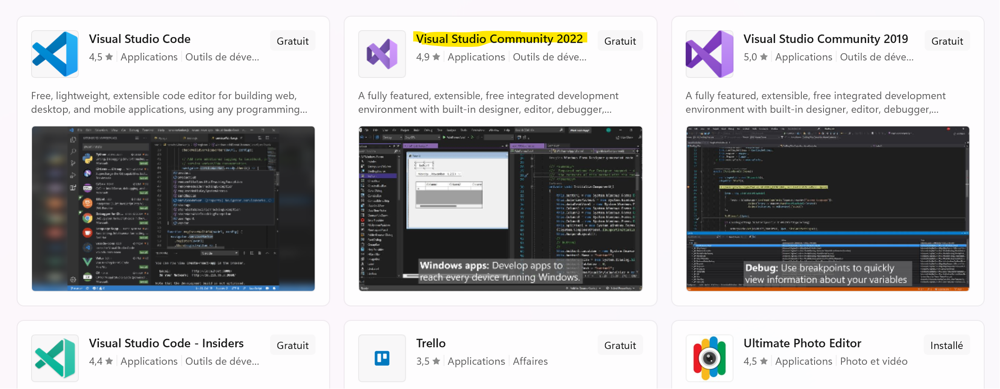
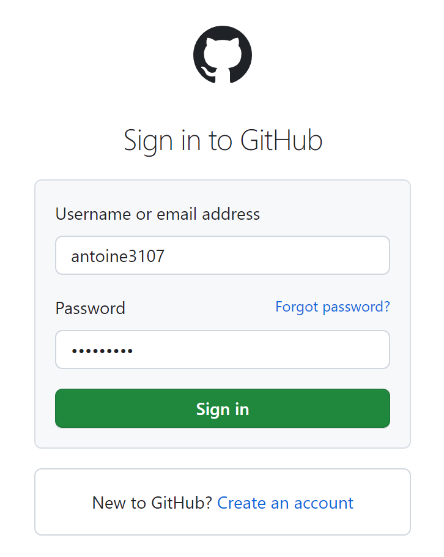
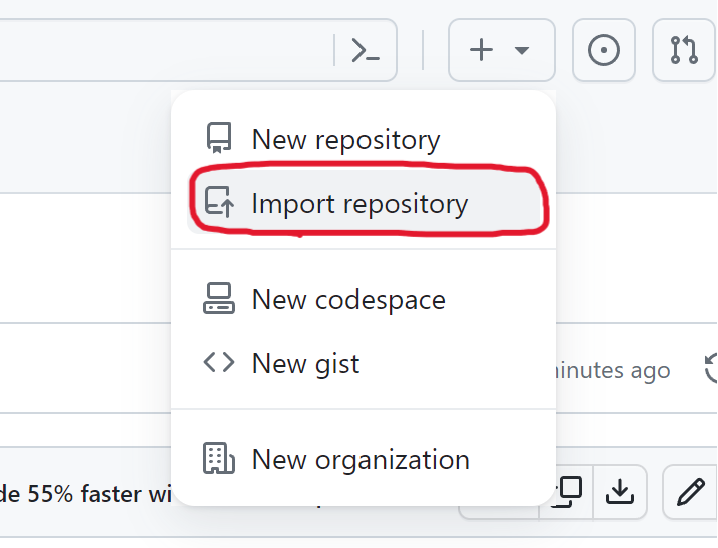
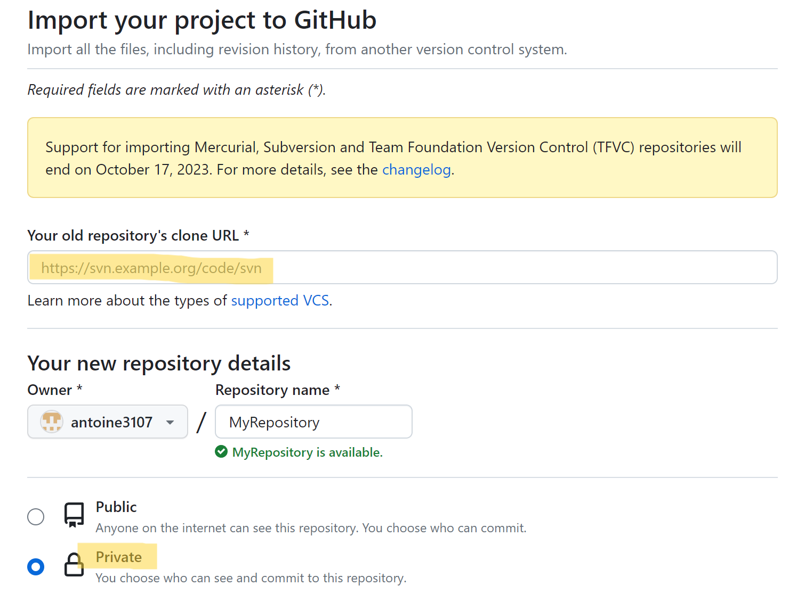

# The development environment

## I] Introduction

During this semester, we will be working on Visual Studio 2022 & GitHub. These two represent our development environment.

<ins>Images 1.1 & 1.2 : Visual Studio 2022 & GitHub</ins>

In this article I'm going to explain how I configured these two tools in the best possible way, and what the advantages of using them are.

This section documents your practical work in week 2.

The main requirements are to show that:

1. Your development environment is correctly set up
2. You understand the setup including potential alternative configuration settings

## II] Environment configuration

First we need to install Visual Studio 2022, our text and code writing tool.
 
 

<ins>Image 2.1 : Make sure you get the Community version.</ins>

 

Once the installation is complete, we need to log in with our Microsoft account. 
The application will then ask us to install a number of tools, which can be installed at any time.

 

To continue, we need to go to the GitHub website to log in to our account. 

<ins>Image 2.2 : We can choose a personal account or one linked to the university.</ins>

We'll then import the teacher's template, which we'll use as the basis for our portfolio. 
This is also known as a repository.

<ins>Images 2.3 & 2.4 : We recommend that you make the deposit private.</ins>

This will allow us to add our personal work over the weeks. There is a section for each week of the course.
For example, the work expected for week 2 must be included in the "week2_setup.md" file.

 

<i>But how do I add content to the GitHub repository?</i>

 

This is where the simultaneous use of Visual Studio and GitHub comes into its own.

So we're going to go back to Visual Studio to clone the GitHub repository we're working on. 
To do this, we click on "Clone repository..." in the Visual Studio start menu, and select the repository you want.
Of course, we'll need to log in to our GitHub account from within Visual Studio.

<b>Now we're all set! We can use Visual Studio and GitHub to build the files we want.</b>

Here, you should include appropriate screenshots with additional commentary.   

**DO**

* Place your image files in the `images` folder
* Choose your screenshots carefully so that they communicate the appropriate information.
  Many screenshots with no clear purpose or with trivial differences are of little value.
* Provide <ins>descriptive</ins> commentary to explain why the screenshot is included. 
  what it shows and point out any particularly significant details.
* Modify your screenshots - for example, by adding arrows, outlines or other highlighting 
  techniques - to enhance their communication value.
* Remove unnecessary material from your screenshots such as toolbars, other windows and 
  computer desktop to eliminate distractions.
* Ensure that any important content is clearly legible. Pay particular attention to text
  size and image resolution.
* Use [numbered captions](https://towardsdev.com/3-ways-to-add-a-caption-to-an-image-using-markdown-f2ca30562be6) 
  as labels for images. Also, use the caption numbers to refer to images in your text.

**DON'T**

* Expect the reader to understand your reasons for including a screenshot. If you can't
  explain it, the screenshot will not do the job on its own.
* Include self-evident comments. For example, don't simply list the values used on a
  configuration page if those values are clearly visible in the screenshot.

## III] Reflection

<i>How are the features available on Visual Studio & GitHub relevant to the work ahead of us?</i>

<b>1. Teamwork</b>

We have a number of group projects lined up for this semester. 
Using a shared group repository will be very useful. 
Everyone will be able to code on their own on their personal computer, and will be able to collect the code on the common repository. 
This will save a phenomenal amount of time.

<b>2. Get an instant preview of your code</b>

The "Preversion" button in Visual Studio lets you see the result of your code in real time. 
So there's no need to constantly test your code from another application. Another great time-saver!

<b>3. Double-backup</b>

If the work done on Visual Studio is lost, there will always be a copy on GitHub. And vice versa!
To ensure that your work is synchronised on both platforms, don't forget to push (from VS) or pull (from GitHub) the code after each commit.

 

<i>What were the difficulties encountered?</i>

We had trouble linking the GitHub repository of the Visual Studio clone. 
We had actually cloned the wrong repository.
So we restarted the configuration from scratch, and this time everything went smoothly.

For this section, decide what points are worth making and structure your content 
appropriately.

**DO**

* Use sub-headings to differentiate between sections
* Provide <ins>reflective</ins> commentary that discusses, for example, limitations of
  your current configuration, how your configuration is appropriate for the current 
  project, alternative configuration that might be appropriate in ther circumstances, 
  etc.
* Mention any difficulties you had setting up your working environment and how you 
  resolved them

**DON'T**

* Repeat the descriptive commentary from point 1
* Give a blow-by-blow account of everything you did. Instead, you should highlight 
  the important points.
