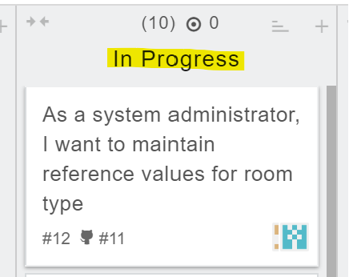

# I] GitHub workflow tools

To start with, let's look at the main workflow tools available on GitHub. 

<b>1. Branches.</b>

Branches allow each team member to work on a different version of the project without interfering with the work of others.

<b>2. Pull requests.</b>

This is a feature that can be used by each team member to propose commits to be integrated into the main branch of the project.

<b>3. Comments.</b>

GitHub allows you to add comments to pull requests and commits. This facilitates collaboration, error detection and code quality improvement.

 

## II] Task completion

To continue working in an organised way as a team, we've started using the zube.io platform, where we can use a Kanban board.

This board shows all the existing tasks in a project. These tasks are sorted by category: "Backlog", "Ready", "In Progress", "In Review", "Done".

Among the tasks available, I've selected "As a system administrator, I want to maintain reference values for room type". 

I immediately placed the card representing this task in the "In Progress" category.

To complete this task, I created a branch on which I wrote my code. Once development was complete, I committed the changes by bringing my code back to the main branch.

Finally, I made a pull request.