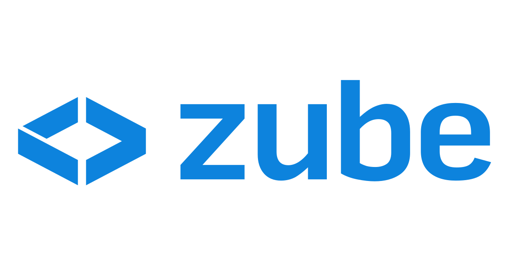
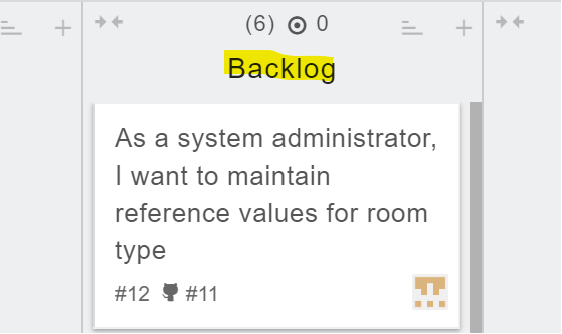

# I] GitHub workflow tools

To start with, let's look at the main workflow tools available on GitHub. 

<b>1. Branches.</b>

To start with, let's look at the main workflow tools available on GitHub. 

1. Branches. 

Branches allow each team member to work on a different version of the project without interfering with the work of others.

2. Pull requests.

This is a feature that can be used by each team member to propose commits to be integrated into the main branch of the project.

3. Comments.

GitHub allows you to add comments to pull requests and commits. This facilitates collaboration, error detection and code quality improvement.

1. You know how to use the workflow tools in GitHub
2. You have successfully carried out the required operations which are:
   * Accept a task from the project backlog
   * Update the task information appropriately
   * Update the task board appropriately
   * Complete the development task on a feature branch
   * Commit your changes with appropriate comments
   * Check your work against the Definition of Done (DoD)
   * Make a pull request
	* small test

## Task workflow

This is a feature that can be used by each team member to propose commits to be integrated into the main branch of the project.

<b>3. Comments.</b>

GitHub allows you to add comments to pull requests and commits. This facilitates collaboration, error detection and code quality improvement.

 

## II] Task completion

To continue working in an organised way as a team, we've started using the zube.io platform, where we can use a Kanban board.

**DO**

Among the tasks available, I've selected "As a system administrator, I want to maintain reference values for room type". 

I immediately placed the card representing this task in the "In Progress" category.

## Reflection

To complete this task, I created a branch on which I wrote my code. Once development was complete, I committed the changes by bringing my code back to the main branch.

Finally, I made a pull request.